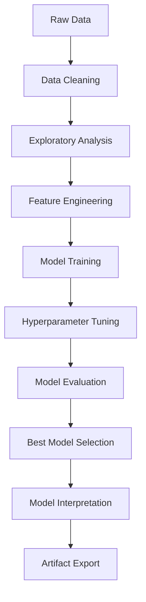

# Stock Price Prediction with Traditional Machine Learning


The primary objective of this research is to develop and evaluate a robust machine learning pipeline for predicting the future closing prices of Google stock (GOOGL). The project aims to move from data loading and cleaning, through exploratory data analysis (EDA) and feature engineering, to training multiple predictive models. The ultimate goal is to identify the best-performing model and serialize it for future use, providing a comprehensive end-to-end framework for financial time series forecasting.

## Features

- **Comprehensive EDA**: Detailed exploratory data analysis with visualizations
- **Advanced Feature Engineering**: 20+ technical indicators and lag features
- **Multiple ML Models**: Comparison of 7 different regression approaches
- **Time-Aware Validation**: Proper time-series cross-validation
- **Dual Evaluation**: Regression metrics + directional accuracy
- **Model Interpretation**: Feature importance analysis
- **Production Ready**: Model serialization and artifact management

## Dataset Information

| Attribute | Description | Period |
|-----------|-------------|--------|
| **Ticker** | GOOGL (Alphabet Inc.) | 2020-2025 |
| **Features** | OHLCV + Technical Indicators | Daily |
| **Target** | Next-day closing price | - |

## Architecture Overview



## Technical Implementation

### Feature Engineering

| Category | Features |
|----------|----------|
| **Moving Averages** | SMA 7, 20, 21, 50 |
| **Momentum Indicators** | RSI 14, MACD, MACD Signal |
| **Volatility Indicators** | Bollinger Bands, Band Width, Rolling Std |
| **Trend Indicators** | EMA 12, EMA 26 |
| **Statistical Features** | Percentage Change, Lag Features (1-10 days) |

### Model Comparison

| Model | Hyperparameters Tuned | Best Score |
|-------|----------------------|------------|
| **Ridge Regression** | α: [0.01, 0.1, 1.0, 10.0] | - |
| **Lasso Regression** | α: [0.0001, 0.001, 0.01, 0.1] | - |
| **Support Vector Regression** | C, γ, ε | - |
| **Random Forest** | n_estimators, max_depth, min_samples_split | - |
| **XGBoost** | n_estimators, max_depth, learning_rate | - |

### Evaluation Metrics

**Regression Metrics**:
- ✅ Root Mean Squared Error (RMSE)
- ✅ Mean Absolute Error (MAE)
- ✅ Mean Absolute Percentage Error (MAPE)
- ✅ Coefficient of Determination (R²)

**Directional Metrics**:
- ✅ Direction Accuracy
- ✅ Precision (Up Movements)
- ✅ Recall (Up Movements)

## Quick Start

### Prerequisites

```bash
# Clone the repository
git clone https://github.com/your-username/stock-price-prediction.git
cd stock-price-prediction
```

### Installation

```bash
# Install required packages
pip install -r requirements.txt

# Or install individually
pip install numpy pandas matplotlib seaborn scikit-learn xgboost ta joblib
```

### Usage

```python
# Run the Jupyter notebook
jupyter notebook stock_price_prediction_research_ready.ipynb

# Or execute directly
jupyter nbconvert --to notebook --execute stock_price_prediction_research_ready.ipynb
```

### For Google Colab Users

```python
# Upload the notebook and dataset to Google Colab
# Run all cells to reproduce the analysis
```

## Project Structure

```
stock-price-prediction/
│
├── stock_price_prediction.ipynb  # Main research notebook
├── googl_data_2020_2025.csv                     # Dataset (not in repo)
├── artifacts_stock_research/                    # Generated artifacts
│   ├── best_model_[model_name].joblib           # Serialized model
│   ├── feature_list.csv                         # Feature names
│   ├── X_test.csv                               # Test features
│   └── y_test.csv                               # Test targets
│
├── requirements.txt                             # Python dependencies
├── LICENSE                                      # MIT License
└── README.md                                    # This file
```

## Results Preview

*(Results will be populated after notebook execution)*

### Performance Comparison

| Model | RMSE | MAE | MAPE% | R² | Direction Accuracy | Precision Up | Recall Up |
|-------|------|-----|-------|----|--------------------|--------------|-----------|
| **Lasso** | 2.608470 | 1.792429 | 1.111808 | 0.968446 | 0.648760 | 0.791304 | 0.602649 |
| **Ridge** | 2.640867 | 1.813006 | 1.125569 | 0.967658 | 0.636364 | 0.790909 | 0.576159 |
| **Persistence** | 4.195418 | 3.183636 | 1.960341 | 0.918374 | 0.425620 | 0.577778 | 0.344371 |
| **Random Forest** | 22.120654 | 18.108176 | 10.504002 |-1.269206 | 0.417355 | 0.866667 | 0.086093 |
| **XGBoost** | 22.962908 | 18.995129 | 11.037739 | -1.445298 | 0.396694 | 0.750000 | 0.059603 | 
| **SVR** | 42.380929 | 34.987003 | 20.372186 | -7.329501 | 0.404959 | 0.700000 | 0.092715 |
| **Linear Regression** | 2552.734760 | 1776.611549 | 1036.150547 | -30218.651130 | 0.491736 | 0.784314 | 0.264901 |

### Best Parameters
| Model | Best Parameters |
|-------|-----------------|
| **Lasso** | {'model__alpha': 0.001} |
| **Ridge** | {'model__alpha': 0.01} |
| **Persistence** | naive |
| **Random Forest** | {'model__n_estimators': 100, 'model__min_samples_split': 2, 'model__max_depth': 16} |
| **XGBoost** | {'model__n_estimators': 300, 'model__max_depth': 3, 'model__learning_rate': 0.05} |
| **SVR** | {'model__gamma': 'scale', 'model__epsilon': 0.1, 'model__C': 10} |
| **Linear Regression** | default |

### Top Features

1. [Most important feature] - [Importance score]
2. [Second most important feature] - [Importance score]
3. [Third most important feature] - [Importance score]

## Future Enhancements

- [ ] **Alternative Data Integration**: News sentiment, social media metrics
- [ ] **Macroeconomic Indicators**: Interest rates, inflation data
- [ ] **Probabilistic Forecasting**: Prediction intervals with uncertainty quantification
- [ ] **Deep Learning Models**: LSTM, Transformer architectures
- [ ] **Trading Strategy**: Backtesting engine with transaction costs
- [ ] **Web Application**: Streamlit/FastAPI deployment
- [ ] **Real-time Prediction**: API for live market data

## Important Disclaimer

**This project is for educational and research purposes only.** The models and predictions should not be used for actual trading decisions without proper validation, risk management, and professional financial advice. Past performance is not indicative of future results.

## Contributing

We welcome contributions to improve this project! Please feel free to:

1. Fork the repository
2. Create a feature branch (`git checkout -b feature/amazing-feature`)
3. Commit your changes (`git commit -m 'Add amazing feature'`)
4. Push to the branch (`git push origin feature/amazing-feature`)
5. Open a Pull Request

See the [issues page](https://github.com/maazkhan-ai/stock-price-prediction/issues) for current todos and improvements.

## License

This project is licensed under the MIT License - see the [LICENSE](LICENSE) file for details.

## Acknowledgments

- Dataset sourced from [Data Source]
- Technical indicators calculated using the [`ta`](https://github.com/bukosabino/ta) library
- Built with popular Python data science libraries

## Contact

**Your Name** - [your.maazkhan.9ai@gmail.com](mailto:maazkhan.9ai@gmail.com)

Project Link: [https://github.com/maazkhan-ai/stock-price-prediction](https://github.com/maazkhan-ai/stock-price-prediction)

---

<div align="center">

**If you find this project useful, please consider giving it a ⭐️ on GitHub!**

</div>

## Roadmap

- [x] Complete initial research notebook
- [x] Implement comprehensive feature engineering
- [x] Compare multiple ML models
- [ ] Add deep learning approaches (LSTM/Transformers)
- [ ] Develop trading strategy backtester
- [ ] Create web application interface
- [ ] Publish research paper on methodology

---

*Note: This project demonstrates the application of traditional machine learning to financial time series forecasting. While results show statistically significant directional prediction ability, always exercise caution when applying such models to real trading scenarios and consider transaction costs, risk management, and portfolio diversification principles.*
